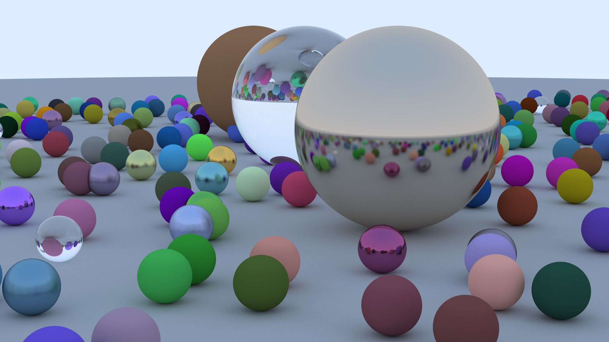

# weekend-ray

Simple raytracer implemented in Rust based of the book 
[Ray Tracing in One Weekend](https://raytracing.github.io/books/RayTracingInOneWeekend.html)

Additional features
+ Multithreaded (using rayon)
+ Loading scenes from json files

# Final image:

